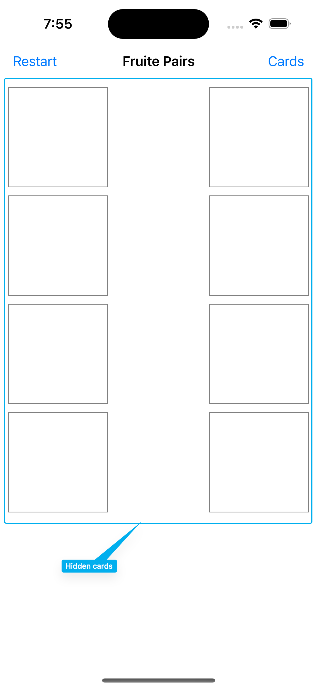
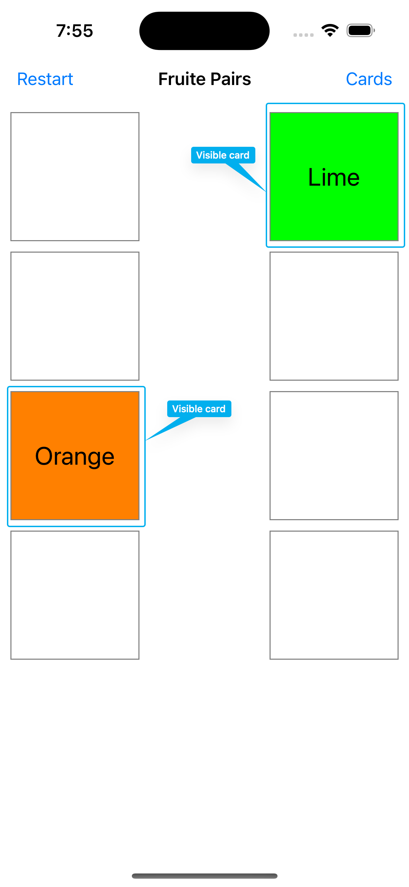
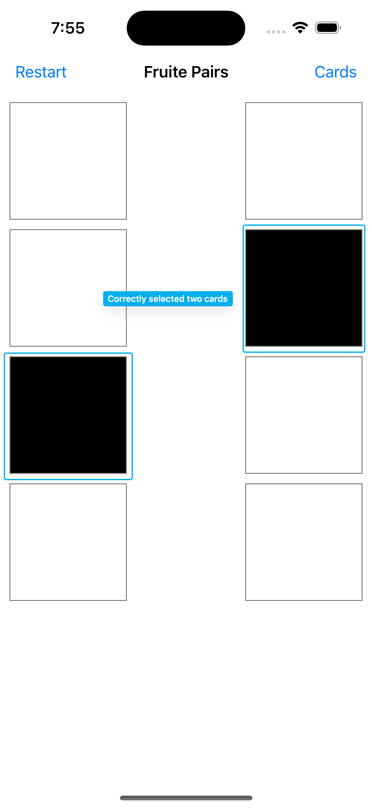
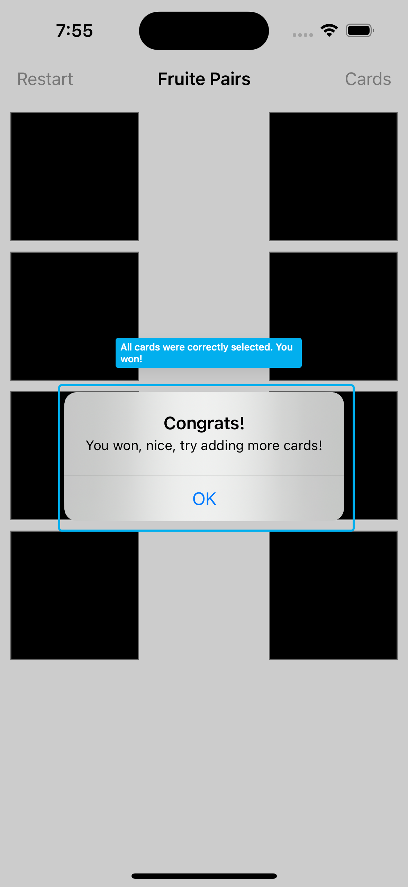
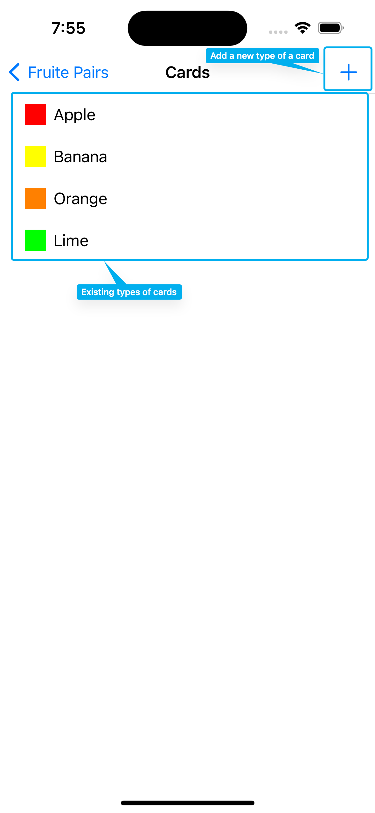

# Fruit Pairs

## Description
Fruit Pairs is a memory game, where you have to find all pairs of cards to win. Cards appear for 1 second, when you tap on them, so, you need to remember where was this exact type of a card. Also, you can add your own cards.

## Screenshots

    

    

    

    

    

## P. S. 
This app was made fully by myself, as a part of **100daysOfSwift** course by **Paul Hudson**. It was a **Milestone**, where you have a small paragraph, describing, what app you have to do this day.